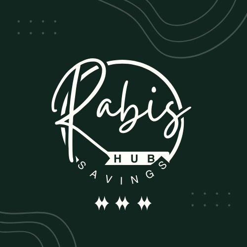

<div align="center">
  
  <br/>
  <h1>Rabi's Saving Hub</h1>
  <p><strong>Ghana's Premium Online Susu Experience</strong></p>
  <p>Digitizing community savings with military-grade security, real-time tracking, and an Awwwards-tier "Emerald God Mode" UI interface.</p>
</div>

---

## 📖 Overview

Rabi's Saving Hub modernizes the traditional Ghanaian *"Susu"* system. This platform allows users to seamlessly select savings plans, securely register with mathematical anti-bot verifications, agree to strict community terms, and get instantly routed to their dedicated Susu WhatsApp groups upon admin approval.

Built for scale, speed, and premium aesthetics, this application replaces scattered manual ledgers with a central dashboard, secure Firebase backend, and a cryptographically locked Admin Panel.

---

## 🚀 Key Features

*   **Emerald UI "God Mode" Design:** Ultra-premium visual styling utilizing fluid shader gradients (`#020c06` to `#10B981`), glassmorphic layouts, and micro-animations for an elite user experience.
*   **Military-Grade Registration:** Dynamic math-captcha challenges to prevent bot-spam and enforce human-verified signups.
*   **Dynamic Agreements:** Personalized, strict, and 100% human-toned terms of service and registration agreements tailored to Ghanaian business nuances.
*   **Role-Based Access Control (RBAC):** Firebase Custom Claims ensures the admin panel is cryptographically locked exclusively to authorized owner emails.
*   **Global Announcements:** Real-time push announcements directly from the Admin Panel to user dashboards.
*   **Live User Map & Data Export:** Visual map integration of user demographics via Leaflet, plus 1-click JSON/CSV exports for administrative offline backups.
*   **Internationalization (i18n):** Support for both English and local dialects (Twi).

---

## 🛠️ Tech Stack

| Domain | Technology | Description |
| :--- | :--- | :--- |
| **Framework** | [Next.js 14](https://nextjs.org/) | App Router, Server/Client components. |
| **Styling** | [Tailwind CSS v4](https://tailwindcss.com/) | Utility-first CSS, custom variables, dynamic theme classes. |
| **Backend** | [Firebase](https://firebase.google.com/) | Authentication, Firestore DB, Custom Claims Admin SDK. |
| **Animations** | [Framer Motion](https://www.framer.com/motion/) | Smooth entrance, stagger, and interactive micro-animations. |
| **Icons** | [Lucide React](https://lucide.dev/) & LordIcon | Scalable SVG icons and animated piggy bank assets. |
| **Language** | [TypeScript](https://www.typescriptlang.org/) | Strict, scalable type-safety across the entire codebase. |

---

## 📂 Project Structure

```text
rabis-hub/
├── src/
│   ├── app/                # Next.js 14 App Router (Pages, Layouts)
│   │   ├── admin/          # Strictly secured admin portal
│   │   ├── auth/           # Login/Registration flow and Math Captcha
│   │   ├── dashboard/      # User dashboard & Announcements
│   │   └── terms/          # Platform Rules & Agreements
│   ├── components/         # Reusable React components
│   │   ├── admin/          # Admin-specific UI elements (e.g., UserMap)
│   │   ├── home/           # Landing page sections (Hero, Trust, Plans)
│   │   ├── layout/         # Globals (Nav, Footer)
│   │   └── ui/             # Core UI components (Buttons, Inputs, Modals)
│   ├── context/            # Global state (AuthContext, i18nContext)
│   └── lib/                # Configs, Firebase Init, Global Types
├── public/                 # Static assets (Logos, Custom premium imagery)
└── tailwind.config.ts      # UI theme extensions (Emerald UI configs)
```

---

## ⚙️ Getting Started (Local Development)

### 1. Prerequisites
Ensure you have Node.js (v18+) and npm installed. Check your versions:
```bash
node -v
npm -v
```

### 2. Clone and Install
```bash
git clone https://github.com/your-username/rabis-hub.git
cd rabis-hub
npm install
```

### 3. Environment Variables
Create a `.env.local` file in the root directory. You will need your Firebase project configuration keys:
```env
NEXT_PUBLIC_FIREBASE_API_KEY=your_api_key
NEXT_PUBLIC_FIREBASE_AUTH_DOMAIN=your_auth_domain
NEXT_PUBLIC_FIREBASE_PROJECT_ID=your_project_id
NEXT_PUBLIC_FIREBASE_STORAGE_BUCKET=your_storage_bucket
NEXT_PUBLIC_FIREBASE_MESSAGING_SENDER_ID=your_sender_id
NEXT_PUBLIC_FIREBASE_APP_ID=your_app_id
```

### 4. Run the Dev Server
```bash
npm run dev
```
Navigate to `http://localhost:3000` to preview the platform.

---

## 🌍 Deployment (Vercel)

This application is fully optimized for single-click deployment on **Vercel**.

1. Navigate to your [Vercel Dashboard](https://vercel.com/dashboard).
2. Click **Add New Project** and connect your GitHub repository.
3. Vercel will auto-detect **Next.js**. 
4. **Important:** Open the **Environment Variables** section and paste your `.env.local` keys.
5. Click **Deploy**. Vercel will handle the CI/CD pipeline. 

---

## 🔒 Administrative Access

To configure admin privileges:
1. Only predefined emails (`rabisavinghub@gmail.com` and `moneyace914@gmail.com`) are mapped to the Custom Claims Firebase architecture.
2. If you need to add a new admin, the Firebase Admin SDK context inside your Node/Server-side function will need to be updated to assign the `{ admin: true }` token claim.

---

<div align="center">
  <p><i>Ready for production. Built to scale. Welcome to the new era of Susu.</i></p>
</div>